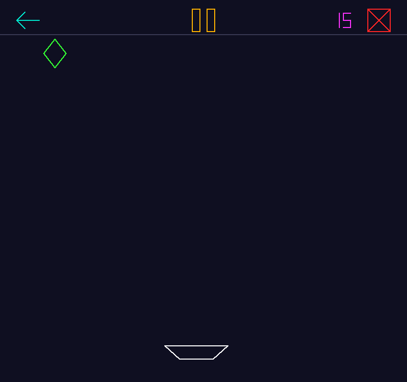
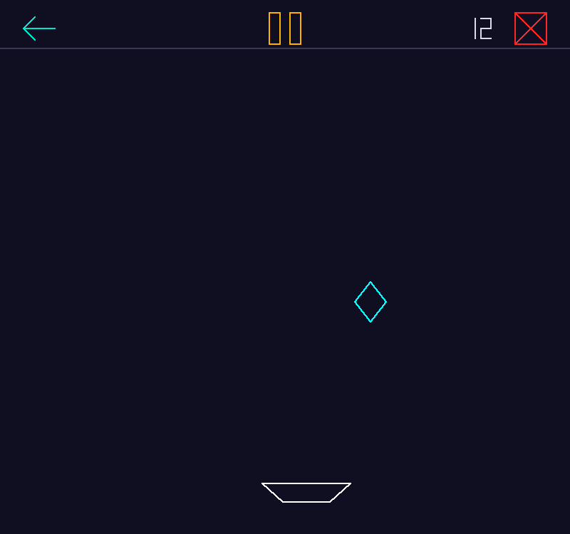

# Catch the Diamonds!

A small retro arcade game in Python + PyOpenGL where **every pixel is placed by hand**.
There are no `GL_LINES` and no polygons. Each line on screen is rasterized with the
**Midpoint Line Algorithm** (generalized to all 8 zones) and drawn as individual `GL_POINTS`.



## Features

- **Hand-written line rasterizer.** The midpoint line algorithm with 8-zone conversion is the only drawing primitive in the game.
- **Rising difficulty.** Diamonds in random colors fall a little faster after every catch.
- **AABB collision** between the diamond and the catcher.
- **Frame-rate independent** movement using delta time on a ~60 FPS timer.
- **Seven-segment score** in the HUD, drawn with the same line routine.
- **Cheat mode**: the catcher tracks the diamond on its own.
- **Clickable buttons** (restart, play/pause, quit), each with a keyboard shortcut.
- **Resizable window.** The playfield is letterboxed, so graphics and button hitboxes scale correctly.

## Getting started

You need Python 3.8+ and a GPU/driver with OpenGL support.

```bash
git clone https://github.com/tanjilaafsarirubina/catch-the-diamonds-opengl.git
cd catch-the-diamonds-opengl
pip install -r requirements.txt
python catch_the_diamonds.py
```

### Platform notes

| OS | GLUT |
| --- | --- |
| Windows | Nothing extra. PyOpenGL 3.1.9+ ships freeglut in its wheel. |
| Linux | Install freeglut: `sudo apt install freeglut3-dev` (Debian/Ubuntu), `sudo dnf install freeglut` (Fedora), `sudo pacman -S freeglut` (Arch). |
| macOS | Uses Apple's built-in GLUT framework. |

## How to play

Move the white catcher left and right to catch the falling diamond. Every catch
adds a point and makes the next diamond fall faster. Miss one and the game is
over: the diamond disappears and the catcher turns red. Hit restart to try again.



| Input | Action |
| --- | --- |
| `←` / `→` | Move the catcher |
| `C` | Toggle cheat mode (the score turns magenta while it's on) |
| `Space` / `P` or the amber button | Play / pause |
| `R` or the teal arrow | Restart |
| `Esc` / `Q` or the red cross | Quit |

Score, pause, and cheat events are also printed to the console.

## How it works

### Midpoint line algorithm (8 zones)

The textbook midpoint algorithm only handles lines in **zone 0**: slope between
0 and 1, drawn left to right. To draw any other line, the game:

1. works out which of the 8 zones the line's direction falls in,
2. maps both endpoints into zone 0,
3. runs the midpoint loop there,
4. maps every generated pixel back to the original zone before plotting it.

```
     \ 2 | 1 /
    3  \ | /  0
    -----+-----
    4  / | \  7
     / 5 | 6 \
```

| Zone | To zone 0 | Back from zone 0 |
| :-: | :-: | :-: |
| 0 | `( x,  y)` | `( x,  y)` |
| 1 | `( y,  x)` | `( y,  x)` |
| 2 | `( y, -x)` | `(-y,  x)` |
| 3 | `(-x,  y)` | `(-x,  y)` |
| 4 | `(-x, -y)` | `(-x, -y)` |
| 5 | `(-y, -x)` | `(-y, -x)` |
| 6 | `(-y,  x)` | `( y, -x)` |
| 7 | `( x, -y)` | `( x, -y)` |

Inside zone 0, the decision variable starts at `d = 2·dy − dx`. At each step, if
`d > 0` the next pixel is north-east and `d += 2·(dy − dx)`. Otherwise it is east
and `d += 2·dy`. The loop uses only integer additions.

### Collision and difficulty

The diamond and the catcher are each treated as an axis-aligned bounding box.
When the boxes overlap, the catch counts. The fall speed is
`85 + 14 × score` px/s, so every catch makes the game slightly harder.

### Tuning

All gameplay numbers are constants at the top of
[`catch_the_diamonds.py`](catch_the_diamonds.py), including window size, catcher
speed, initial fall speed, speed increment, and colors.

## Project structure

```
catch-the-diamonds-opengl/
├── catch_the_diamonds.py   # the whole game
├── requirements.txt
├── docs/
│   ├── demo.gif
│   └── screenshot.png
├── LICENSE
└── README.md
```

## License

Released under the [MIT License](LICENSE).
